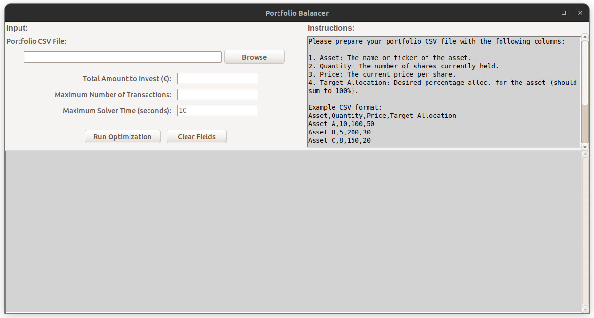

# Portfolio Balancer

A Python script to help you rebalance your investment portfolio towards your target allocation while minimizing transaction costs.

## Features

- **Optimal Purchase Orders**: Calculates the optimal purchase orders to minimize deviation from your target allocation.
- **Transaction Limitation**: Limits the number of transactions to reduce costs associated with trading.
- **Minimum Investment Threshold**: Ensures that at least a specified minimum percentage of your available funds is invested.
- **CSV Input**: Reads current portfolio positions and target allocations from a user-friendly CSV file.
- **Full GUI**: Graphical user interface for Linux users (tested on Ubuntu 22.04)

### Exemple usage

Below is an exemple of the starting page:



You can find more screenshots in .

## Installation

1. **Clone the repository:**

   ```bash
   git clone https://github.com/JeanDuboisDeBeau/portfolio-balancer.git
   ```

2. **Navigate to the project directory:**

   ```bash
   cd portfolio-balancer
   ```

3. **Install the required packages:**

   ```bash
   pip install -r requirements.txt
   ```

## Usage

1. **Prepare your `portfolio.csv` file with the following columns:**

   - **`Asset`**: Name of the asset (e.g., NASDAQ, WORLD).
   - **`Quantity`**: Current quantity held for each asset.
   - **`Price`**: Current price of each asset.
   - **`Target Allocation`**: Target percentage allocation for each asset (e.g., `25` for 25%).

   **Example:**

| Asset   | Quantity | Price (€) | Target Allocation (%) |
|---------|----------|-----------|-----------------------|
| NASDAQ  | 43       | 10.00     | 35                    |
| WORLD   | 15       | 8.50      | 25                    |
| GOLD    | 25       | 12.00     | 20                    |
| SP500   | 5        | 5.00      | 10                    |
| EM      | 56       | 20.00     | 5                     |
| CRYPTO  | 0        | 12.20     | 5                     |


2. **Run the script:**

   ```bash
   python portfolio_balancer.py
   ```

3. **Follow the prompts:**

   - **Enter the total amount to invest** (e.g., `1235.36`).
   - **Enter the maximum number of transactions** you wish to perform (e.g., `3`).

4. **Results:**

   The script will display the recommended purchase orders and present the updated allocation of your portfolio.

## Example Output

Assuming you have the above `portfolio.csv` and you wish to invest **€1,235.36** with a maximum of **3 transactions**, the output might look like this:

```
Please enter the total amount to invest (€): 1623.25
Please enter the maximum number of transactions: 4

Orders to place to minimize deviation from the target allocation:
- Buy 80 shares of NASDAQ for 800.00 €
- Buy 56 shares of WORLD for 476.00 €
- Buy 67 shares of SP500 for 335.00 €
- Buy 1 shares of CRYPTO for 12.20 €

Total amount invested: 1623.20 € (100.00% of the amount to invest)

Comparison of old and new positions:
 Asset  Old Quantity  New Quantity Change  Old Weight (%)  New Weight (%)  Target Allocation (%)  Deviation (%)
NASDAQ            43           123      →           21.47           33.92                  35.00           1.08
 WORLD            15            71      →            6.37           16.65                  25.00           8.35
  GOLD            25            25                  14.98            8.27                  20.00          11.73
 SP500             5            72      →            1.25            9.93                  10.00           0.07
    EM            56            56                  55.93           30.89                   5.00          25.89
CRYPTO             0             1      →            0.00            0.34                   5.00           4.66

Allocation index: 0.7411 (1 indicates a perfect match with the target allocation)
```

**Notes:**

- The **Allocation Index** is a measure of how closely your portfolio matches the target allocation after the suggested transactions. A value of **1** indicates a perfect match.

## Dependencies

- **Python 3.x**
- **pandas**
- **PuLP**

**Install dependencies with:**

```bash
pip install -r requirements.txt
```

## Files

- **`portfolio_balancer.py`**: Main script containing the code for portfolio rebalancing.
- **`portfolio.csv`**: Sample CSV file for your portfolio data.
- **`requirements.txt`**: List of required Python packages.
- **`.gitignore`**: File to ignore irrelevant files/folders in version control.
- **`LICENSE`**: Project license.

## License

This project is licensed under the MIT License - see the [LICENSE](LICENSE) file for details.

## Contributing

Contributions are welcome! Feel free to submit issues or pull requests to improve the project.

## Future Improvements

- **Sell Orders Integration**: Implement the ability to include sell orders, allowing the script to recommend selling over-allocated assets for a more accurate rebalancing.

- **Fractional Shares Support**: Modify the script to handle fractional share quantities, enhancing precision in rebalancing, especially for assets like ETFs.

- **Automated Data Retrieval**: Integrate financial APIs to automatically fetch current asset prices and portfolio data from brokerage accounts.

- **Advanced Optimization Techniques**: Incorporate more sophisticated optimization methods, such as quadratic programming, to factor in elements like risk, volatility, and transaction fees.

- **Multi-Currency Handling**: Extend support for portfolios containing assets in different currencies, including real-time exchange rate conversions.

- **Reporting and Visualization Tools**: Generate detailed reports and visualizations, such as charts and graphs, to provide insights into portfolio performance and allocation changes.

- **Customization Options**: Allow users to set additional constraints or preferences, such as minimum trade sizes, sector exposure limits, or ethical investment considerations.

## Contact

For questions or assistance, please [contact me](github.agency178@passinbox.com).
